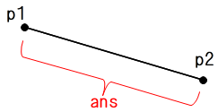

# CSGeometries
**概要**
==========
https://github.com/68B09/CSGeometries をCSLibraryに移動させたものです。  
線分の長さや線交差座標等を求めるための幾何計算クラスや、RGB-HSV相互変換などのカラーモデル変換クラスを実装しています。  
1. 座標は直交座標系です  
1. 座標の管理には独自のDouble型 **PointD** クラスを使用しています  
1. 条件を満たさないパラメータを与えると不正な結果を返すメソッドもあることに注意してください  
1. ColorDやHSV構造体の多くのメンバ変数が取る値が0.0～1.0であることに注意が必要です

動作に関してはソースファイルも参照して下さい。  

●**線分長取得**  
**public static double GetLength(PointD p1, PointD p2)**  
二点(p1-p2)間の距離を返します。  


**public static double GetLength(double pX1, double pY1, double pX2, double pY2)**  
二点間の距離を返します。  


●**内積**  
**public static double GetDot(PointD p1, PointD p2)**  
内積(dot)を返します。  
※ans.  p1･p2 = (p1.X ･ p2.X) + (p1.Y ･ p2.Y)  

●**線に対する点の位置**  
**public static double GetPointLR(PointD pStart, PointD pEnd, PointD pPoint)**  
線(pStart→pEnd)に対して点(pPoint)が左右のどちらにあるのかを判定し、左にあれば**負**、右にあれば**正**、線上であれば**0**を返します。  


●**線交差判定**  
**public static double IsCross(PointD pL1_1, PointD pL1_2, PointD pL2_1, PointD pL2_2)**  
線1(pL1)と線2(pL2)が交差すれば**0以外**、しなければ**0**を返します。  
「線分」ではなく「直線」で判定するため、交点が線分上にない場合でも交差する場合は0以外を返します。  
言い換えれば「二つの線が平行か？」を判定します。  
  
この図では線が交差するため0以外の値が返ります。  

●**交点取得**  
**public static PointD GetCrossPoint(PointD pL1_1, PointD pL1_2, PointD pL2_1, PointD pL2_2, out bool pIsCross)**  
二つの直線の交点座標を返します。  
交差する場合はpIsCrossにtrueが、しなかった場合はfalseが設定されます。  
  
この図では点ansの座標が返り、pIsCrossにtrueが設定されます。  

●**矩形内判定**  
**public static bool InRect(PointD p1, PointD p2, PointD pPoint)**  
対角線(p1-p2)で指定される矩形内に点(pPoint)が入っているかを判定し、入っていれば**true**、入っていなければ**false**を返します。  
p1およびp2は対角線を表していれば良いので、必ずしもp1&lt;p2である必要はありません。  

●**矩形内判定(複数ポイント)**  
**public static bool InRect(PointD p1, PointD p2, params PointD[] pPoints)**  
対角線(p1-p2)で指定される矩形内に点群(pPoints)が全て入っているかを判定し、入っていれば**true**、入っていなければ**false**を返します。  
p1およびp2は対角線を表していれば良いので、必ずしもp1&lt;p2である必要はありません。  

●**垂線交点取得**  
**public static PointD GetPerpendicularlinePoint(PointD p1, PointD p2, PointD pPoint)**  
点(pPoint)から線(p1-p2)に垂線を引いた時の交点座標を返します。  
  

●**垂線交点取得(線分上判定)**  
**public static PointD? GetPerpendicularlinePointOnLine(PointD p1, PointD p2, PointD pPoint)**  
GetPerpendicularlinePoint()と同じく垂線の交点を返しますが、交点がp1-p2上に無い場合はnullを返します。  

●**垂線長取得**  
**public static double GetPerpendicularlineLength(PointD p1, PointD p2, PointD pPoint)**  
点(pPoint)から線(p1-p2)に垂線を引いた時の垂線の長さを返します。  
  

●**垂線長取得(線分上判定)**  
**public static double? GetPerpendicularlineLengthOnLine(PointD p1, PointD p2, PointD pPoint)**  
GetPerpendicularlineLength()と同じく垂線の長さを返しますが、交点がp1-p2上に無い場合はnullを返します。  

●**最小・最大座標整合**  
**public static void MarshalMaxmin(ref Point pMin, ref Point pMax)**  
**public static void MarshalMaxmin(ref PointD pMin, ref PointD pMax)**  
二つの座標(pMin,pMax)を、pMinが左下、pMaxが右上になるように調整します。  

●**折れ線がなす角度**  
**public static bool GetAngle(PointD p1, PointD p2, PointD p3, out double pAngle)**  
折れ線p1-p2-p3がなす角度(radian)をpAngleに設定します。  
pAngleの値は0～πです。  
角度が得られた場合はtrueを、線分の長さが0などで計算出来なかった場合はエラーとしてfalseを返します。  
  

●**最小最大座標取得**  
**public static void GetMaxmin(PointD[] pPoints, out PointD pMin, out PointD pMax)**  
座標列(pPoints)中の最小X,Y座標をpMinへ、最大X,Y座標をpMaxへ設定します。  
つまり座標列が構成する矩形領域の左下座標と右上座標が設定されます。  
pMinもしくはpMaxの点が座標列中に存在しない場合もあることに注意してください。  
  

●**Radian→Degree**  
**public static double RadianToDegree(double pAngle)**  
ラジアン(pAngle)をディグリーに変換して返します。  
(ex) RadianToDegree(Math.PI / 2) → 90  

●**Degree→Radian**  
**public static double DegreeToRadian(double pAngle)**  
ディグリー(pAngle)をラジアンに変換して返します。  
(ex) DegreeToRadian(180) → 3.141592…

<a name="Saturation"></a>●**飽和丸め**  
**public static double Saturation(double pValue, double pMin = 0.0, double pMax = 1.0)**  
pValueの値が最小(pMin)から最大(pMax)の範囲に収まるように調整し、その値を返します。  
(ex)Saturation(-1.0, 1.0, 10.0) → 1.0  
(ex)Saturation(11.0, 1.0, 10.0) → 10.0  

●**範囲丸め**  
**public static double GetInRange(double pValue, double pMin, double pMax)**  
メソッド名が異なるだけで[`Saturation(pValue, pMin, pMax)`](#Saturation)と同じです。  

●**対角座標から4点を作成**  
**public static void Rect2PointTo4Point(Point p1, Point p2, System.Collections.Generic.IList&lt;Point&gt; pTable)**  
対角座標(p1-p2)から四隅の座標を作成しそれを返します。  
pTableの要素数は4以上確保してください。  
本メソッド呼び出し後はpTable[0]には左下、[1]には右上座標が入ります。  
また、座標は時計回り順で設定されます。  

●**最大公約数取得**  
**public static long GCD(long p1, long p2)**  
p1とp2の最大公約数を返します。  
p1もしくはp2が負の場合は例外をスローします。  
p1もしくはp2のどちらかが0の場合は0を返します。  
(ex)GCD(4, 6) → 2  
(ex)GCD(127, 255) → 1  

●**最小公倍数取得**  
**public static long LCM(long p1, long p2)**  
p1とp2の最小公倍数を返します。  
p1もしくはp2が負の場合は例外をスローします。  
p1もしくはp2のどちらかが0の場合は0を返します。  
(ex)LCM(6, 10) → 30
(ex)LCM(127, 255) → 32385

●**素因数分解**  
**public static System.Collections.Generic.List&lt;long&gt; PrimeFactorization(long pValue)**  
pValueの素因数分解を行い因数のリストを返します。  
pValueが1未満の場合は例外をスローします。  
(ex)PrimeFactorization(3 * 4 * 5 * 7 * 11) → [2,2,3,5,7,11]  

------
# CSGeometries.Units
**概要**
==========
SIなどの単位に関するクラス群です。  
1. SIUnit … 10を底とするSI接頭辞(u,m,k,M,...)  
1. BinUnit … 2を底とする2進接頭辞(Ki,Mi,Gi...)  
1. DPIUnit … DotPerInchを基準とした各種単位への変換  
     
double型の精度や演算誤差などにより必ずしも正確な変換が行えるとは限らないことに注意して下さい。  
特に大きな単位や小さな単位では誤差が生じやすくなります。  

動作に関してはソースファイルも参照して下さい。  

●**単位変換(正規化)**
------
**double Normalize(double pValue, out string pUnitName)**  
  
正規化後の値とその単位文字列を返します。  
SIUnitは1000単位、BinUnitは1024単位で正規化します。  
```
SIUnit unit = new SIUnit();
string unitName;
double ans = unit.Normalize(1234, out unitName);
// ans = 1.234, unitName = "k"
```

```
BinUnit unit = new BinUnit();
string unitName;
double ans = unit.Normalize(1263.616, out unitName);
// ans = 1.234, unitName = "Ki"
```
  
●**冪指数取得**  
------
**int GetBekisisu(string pUnitName)**  
  
単位名に対応する冪指数を返します。  
SIUnitは10^n^の、BinUnitは2^n^のnを返します。  
単位名の大文字小文字は厳密に扱われます。  
```
SIUnit unit = new SIUnit();
int beki = unit.GetBekisisu("k");
// beki = 3
```

```
BinUnit unit = new BinUnit();
int beki = unit.GetBekisisu("Ki");
// beki = 10
```

●**DPIUnit**  
------
DPIを基準として各種単位への変換を行います。  

・ミリメートルをドット(ピクセル)数へ変換。  
```
DPIUnit dpiUnit = new DPIUnit(p_graphics.DpiX);
float width = dpiUnit.MMToDot<float>(10);    // 10mmをドット数へ変換
```
